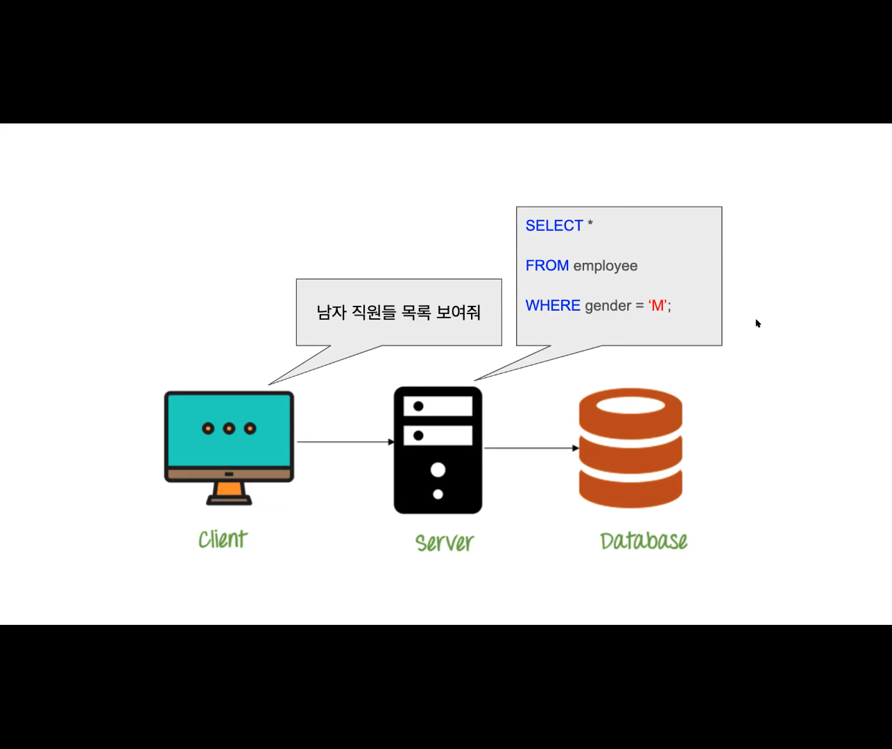
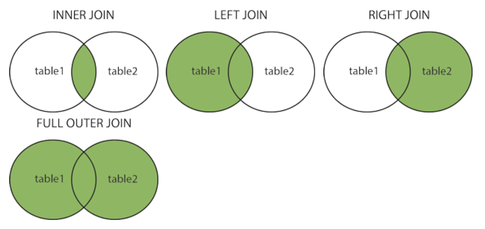

# Sprint - Database & SQL

## Intro Database & SQL
* Query문 사용
* 스키마 설계와 더 나은 방향성 찾기

* SQL: Structure Query Language(구조화 된 Query 언어)
* Query: 직역하면 질의문 이라는 의미
* 저장되어 있는 정보를 필터하기 위한 질문
* 결국 SQL이란 데이터베이스 용 프로그래밍 언어, 데이터베이스에 쿼리를 보내 원하는 데이터만을 추출
* 데이터베이스가 필요한 이유: 서버에 파일로 저장해서 사용해도 되지만, 원하는 데이터만 가져올 수 없고 항상 모든 데이터를 가져온 뒤 서버에서 필터링 필요
* 그래서 데이터베이스는 데이터에 특화된 서버라고 보면 됨
* 엑셀과 비슷하고, 쿼리문을 통해 필터링 가능

```
// DB 쿼리문 예시
SELECT *    // *(모든 열을) 선택하라
FROM employee   // employe에서 
WHERE gender = 'M'  //gender = 'M'인 데이터들을
```



## Learn SQL - Part 1

### SQL Intro
* SQL은 데이터베이스에 다루고 접근하기 위한 스탠다드 언어다.

**What is SQL?**
* 구조화된 쿼리 언어이다.
* 데이터베이스를 다루고 접근한다.
* 1986년 ANSI, 1987년 ISO의 기준이다.

**What can SQL do?**
* 데이터베이스에 대해 쿼리를 실행
* 데이터베이스로 부터 데이터를 조회
* 데이터베이스에 기록을 삽입, 갱신, 삭제
* 새로운 데이터베이스 생성
* 데이터베이스에 새로운 테이블 생성
* 데이터베이스에 stored procedures를 생성
* 데이터베이스에 뷰를 생성
* 테이블, 프로시져, 뷰에 허가를 셋할 수 있다.

**SQL is a Standard - BUT...**
* SQL이 ANSI/ISO의 기준이라 할지라도, SQL언어의 다른 버젼들도 존재한다. 
* 그렇지만 SELECT, UPDATE, DELETE, INSERT, WHERE과 같은 주요 명령어는 지원된다.

**Using SQL in Your Web Site**
* 데이터베이스로 부터 데이터를 보여주는 웹사이트를 구축하기 위해 다음과 같은 것들이 필요하다.
    1. RDBMS 데이터베이스 프로그램(MySQL 같은)
    2. 서버사이드 스크립트 언어(PHP 같은)
    3. SQL을 통해 얻고자 하는 데이터
    4. HTML/CSS 스타일의 페이지

**RDBMS**
* RDBMS: Relational Database Management System
* RDBMS는 모든 데이터베이스 시스템과 SQL의 토대이다.
* RDBMS의 데이터는 테이블이라고 불리는 데이터베이스 객체로 저장된다.
* 테이블은 연관된 데이터의 컬렉션이고, 행과 열로 이루어진다.

```sql
Your Database:
Tablename	    Records
Customers	    91
Categories	    8
Employees	    10
OrderDetails	518
Orders	        196
Products	    77
Shippers	    3
Suppliers	    29

-- Customers 필터링
SELECT *
FROM Customers;
```

### SQL Syntax

**Database Tables**
* 데이터베이스는 하나 또는 그 이상의 테이블이 포함된며, 각각의 테이블은 이름(Customers 같은)에 의해 확인된다.
* 문법의 대문자와 소문자는 같은 기능을 하지만 대문자를 사용
* 몇몇 데이터베이스 시스템에서는 각각의 SQL 구문 끝에 세미콜론이 요구된다.
* 세미콜론은 데이터베이스 시스템에서 각각의 SQL구문을 분리하는 기준적인 방법이다.

**Some of The Most Important SQL Commands**
* SELECT - 데이터베이스로 부터 데이터를 추출
* UPDATE - 데이터베이스의 데이터를 갱신
* DELETE - 데이터베이스로 부터 데이터를 삭제
* INSERT INTO - 데이터베이스로 새로운 데이터를 삽입
* CREATE DATABASE - 새로운 데이터베이스를 생성
* ALTER DATABASE - 데이터베이스를 수정
* CREATE TABLE - 새로운 테이블을 생성
* ALTER TABLE - 테이블을 수정
* DROP TABLE - 테이블을 삭제
* CREATE INDEX - 검색 키(search key) 같은 인덱스를 생성
* DROP INDEX - 인덱스를 삭제

### SQL SELECT Statement
* SELECT 구문은 데이터베이스로 부터 데이터를 선택(select) 하기 위해 사용된다.
* 반환된 데이터는 result-set이라고 불리는 result table에 저장된다.
* 모든 필드를 선택하고 싶다면 '*'을 이용한다.

```sql
-- 모든 column을 선택할 땐 '*'
SELECT LastName, FirstName
FROM Employees;

-- Employees 테이블로 부터 가져온 결과
LastName	FirstName
Davolio	    Nancy
Fuller	    Andrew
Leverling	Janet
Peacock	    Margaret
Buchanan	Steven
Suyama	    Michael
King	    Robert
Callahan	Laura
Dodsworth	Anne
West	    Adam
```

* 원하는 열에서 중복된 데이터를 제외하고 필터링하고 싶을때는 'DISTINCT' 사용한다.

```sql
-- 중복되는 country를 제외하고 필터링
SELECT DISTINCT Country
FROM Customers;
```

### The SQL WHERE Clause
* WHERE은 기록을 필터하는데 사용된다.
* WHERE은 특정한 상태를 만족하는 기록들만 추출하는데 사용된다.

```sql
-- Country 열에서는 Mexico만 해당하는 데이터 필터링
SELECT *
FROM Customers
WHERE Country='Mexico';
```

**Text Fields vs. Numeric Fields**
* SQL은 텍스트 값을 감싸는 홑따옴표가 요구된다.(대부분은 쌍따옴표도 가능)
* 숫자는 따옴표로 감싸면 안된다.

```sql
SELECT * FROM Customers
WHERE CustomerID=1;
```

**Operators in The WHERE Clause**
* '='	    :  같은 값만
* '>'	    :  더 큰 값만	
* '<'	    :  더 작은 값만	
* '>='	    :  크거나 같은 값만	
* '<='	    :  작거나 같은 값만	
* '<>'	    :  같이 않은 값만 (버전에 따라 !=)
* 'BETWEEN' :	 특정 범위	

```sql
-- Products 테이블에서 Price열의 값이 50에서 60사이의 값만 필터링
SELECT * 
FROM Products
WHERE Price BETWEEN 50 AND 60;        
```

* 'LIKE'    :  같은 패턴만

```sql
-- City 열에서 's'로 시작하는 값만
SELECT *
FROM Customers
WHERE City LIKE 's%';
```

* IN	     특정한 복수의 값들만

```sql
-- City에서 'Paris'와 'London'만
SELECT * FROM Customers
WHERE City IN ('Paris','London');
```

### SQL AND, OR and NOT Operators
* WHERE절은 AND, OR, NOT 연산자와 조합될 수 있다.
* AND, OR는 하나의 조건 이상에 기반한 레코드를 필터하기 위해 사용된다.
    1. AND 연산자는 모든 조건들이 TRUE인 레코드들을 표시한다.
    2. OR 연산자는 어떤 조건이 TRUE인 레코드를 표시한다.
* NOT 연산자는 TRUE가 아닌 조건의 레코드를 표시한다.

```sql
-- 'AND' : Country가 'Germany' 이고 City가 'Berlin'인 값을 필터링
SELECT *
FROM Customers
WHERE Country='Germany' AND City='Berlin';

-- 'OR' : City가 'Berlin' 이거나 'München'인 값을 필터링
SELECT *
FROM Customers
WHERE City='Berlin' OR City='München';

-- 'NOT' : Country가 'Germany'가 아닌 값을 필터링
SELECT *
FROM Customers
WHERE NOT Country='Germany';

-- 'AND'와 'OR'의 결합
SELECT *
FROM Customers
WHERE Country='Germany' AND (City='Berlin' OR City='München');

-- 'NOT'과 'AND'의 결합
SELECT *
FROM Customers
WHERE NOT Country='Germany' AND NOT Country='USA';
```

### SQL ORDER BY Keyword
* ORDER BY 키워드는 오름차순 또는 내림차순으로 result-set을 정렬하기 위해 사용된다.
* 디폴트로 오름차순으로 정렬되며, 내림차순은 DESC 키워드를 이용한다.

```sql
-- Country열의 값을 A-Z 순으로 정렬하여 필터링
SELECT *
FROM Customers
ORDER BY Country;

-- County열의 값을 Z-A 순으로 정렬하여 필터링
SELECT *
FROM Customers
ORDER BY Country DESC;

-- County열의 값을 A-Z 순으로 정렬하고 같은 County 값이 있다면 CustomerName을 A-Z 순으로 정렬
SELECT *
FROM Customers
ORDER BY Country, CustomerName;

-- Country열의 값을 A-Z 순으로 정렬하여 필터링하고 같은 County 값이 있다면 CostomerNamedmf Z-A 순으로 정렬
SELECT *
FROM Customers
ORDER BY Country ASC, CustomerName DESC;
```

### SQL INSERT INTO Statement
* INSERT INTO 구문은 테이블에 새로운 레코드를 삽입하기 위해 사용된다.

```sql
-- Customers 테이블의 괄호 안에 속하는 열에 VALUES의 값들을 순서대로 삽입
INSERT INTO Customers (CustomerName, ContactName, Address, City, PostalCode, Country)
VALUES ('Cardinal','Tom B. Erichsen','Skagen 21','Stavanger','4006','Norway');        
```

**Insert Data Only in Specified Columns**
* 특정 열에 데이터를 삽입하는 것도 가능하다.

```sql
-- 특정 열에 값들이 삽입되고, 열거되지 않은 열에는 'null' 자동삽입
INSERT INTO Customers (CustomerName, City, Country)
VALUES ('Cardinal', 'Stavanger', 'Norway');
```

### SQL NULL Values
**What is a NULL Value?**
* Null이 있는 필드는 값이 없는 필드이다.
* 만약 테이블의 필드가 옵셔널이라면 이는 새로운 레코드를 삽입하거나 해당 필드에 값을 추가하는 것 없이 갱신하는 것이 가능하다. 그리고 그 필드는 NULL 값으로 저장된다.

**How to Test for NULL Values?**
* =, <, or <>와 같은 비교 연산자로 NULL 값을 테스트하는 것은 불가능하다.
* 대신에 IS NULL, IS NOT NULL 연산자를 사용해야 한다.

```sql
-- 'IS NULL' : Address 열에 NULL인 값을 필터링
SELECT CustomerName, ContactName, Address
FROM Customers
WHERE Address IS NULL;

-- 'IS NOT NULL' : Address 열에 NULL이 아닌 값을 필터링
SELECT CustomerName, ContactName, Address
FROM Customers
WHERE Address IS NOT NULL;
```

### SQL Wildcards
**SQL Wildcard Characters**
* Wildcard Character는 문자열의 하나 이상의 문자를 대체하는데 사용된다.
* Wildcard Character는 SQL LIKE 연산자와 함게 사용된다.
* LIKE 연산자는 열에서 특정한 패턴을 찾기 위해 WHERE 절에서 사용된다.

**Wildcard Characters in SQL Server**
1. '%'  : 0 또는 그 이상의 문자를 표시한다.
    * bl% finds bl, black, blue, and blob
2. '_'  : 하나의 문자를 표시한다.
    * h_t finds hot, hat, and hit
3. '[]' : 브라켓 안의 문자 중 하나를 표시한다.
    * h[oa]t finds hot and hat, but not hit
4. '!'  : 브라켓 안의 없는 문자를 표시한다.
    * h[!oa]t finds hit, but not hot and hat
5. '-'  : 문자의 범위를 표시한다.
    * c[a-b]t finds cat and cbt

**Using the % Wildcard**
```sql
-- City 열의 'ber'로 시작하는 값을 필터링
SELECT *
FROM Customers
WHERE City LIKE 'ber%';

-- City 열의 'es'가 앞, 뒤, 앞뒤에 포함된 값을 필터링
SELECT *
FROM Customers
WHERE City LIKE '%es%';
```

**Using the _ Wildcard**
```sql
-- City 열에서 'L()n()on'에 해당하는 값을 필터링. ()안에는 어떠한 문자 하나가 들어갈 수 있다.
SELECT *
FROM Customers
WHERE City LIKE 'L_n_on';
```

**Using the [charlist] Wildcard**
```sql
-- City 열에서 b, s, p로 시작하는 값을 필터링
SELECT *
FROM Customers
WHERE City LIKE '[bsp]%';

-- City 열에서 a-c사이의 문자로 시작하는 값을 필터링
SELECT * FROM Customers
WHERE City LIKE '[a-c]%';
```

**Using the [!charlist] Wildcard**
```sql
-- City 열에서 b, s, p로 시작하지 않는 값을 필터링
SELECT *
FROM Customers
WHERE City LIKE '[!bsp]%';

-- 또는 NOT LIKE 연산자 사용
SELECT *
FROM Customers
WHERE City NOT LIKE '[bsp]%';
```

### SQL Aliases
* SQL alias는 테이블, 테이블의 열에 임시로 이름을 주는데 사용된다.
* allias는 더 읽기 쉬운 열 이름을 만드는데 사용된다.
* 하나의 allias는 쿼리가 지속되는 동안만 존재한다.

```sql
-- CustomerID => ID, CustomerName => Customer로 보이게 필터링
SELECT CustomerID AS ID, CustomerName AS Customer
FROM Customers;

-- 공백이 있는 allias는 "" 또는 []로 묶기
SELECT CustomerName AS Customer, ContactName AS [Contact Person]
FROM Customers;

-- Address, PostalCode, City, Country를 묶어서 Address로 보이게 필터링(아래는 MySQL 방식)
SELECT CustomerName, CONCAT(Address,', ',PostalCode,', ',City,', ',Country) AS Address
FROM Customers;

-- Customers 테이블을 c, Orders 테이블을 o로 해서 각 테이블에서 필요한 열의 WHERE절의 해당하는 값을 필터링
SELECT o.OrderID, o.OrderDate, c.CustomerName
FROM Customers AS c, Orders AS o
WHERE c.CustomerName="Around the Horn" AND c.CustomerID=o.CustomerID;
```


## Learn SQL - Part 2

### SQL Joins
* JOIN 절은 두 개 이상의 테이블로부터 행을 결합하기 위해 사용된다.

```sql
-- Orders.CustomerID와 Customers.CustomerID가 같은 값 중에 두 테이블에서 필요한 열들의 값을 필터링
SELECT Orders.OrderID, Customers.CustomerName, Orders.OrderDate
FROM Orders 
INNER JOIN Customers ON Orders.CustomerID=Customers.CustomerID;
```

**Different Types of SQL JOINs**
* SQL의 JOIN의 타입별 차이점
    1. (INNER) JOIN : 양 테이블에서 매치되는 값의 레코드 반환
    2. LEFT (OUTER) JOIN : 매치되는 오른쪽 테이블의 레코드 + 왼쪽의 모든 레코드를 반환
    3. RIGHT (OUTER) JOIN : 매치되는 왼쪽 테이블의 레코드 + 오른쪽의 모든 레코드를 반환
    4. FULL OUTER JOIN : 왼쪽 또는 오른쪽 테이블에서 매치되는 항목이 있으면 모든 레코드를 반환



### SQL INNER JOIN Keyword
* INNER JOIN 키워드는 양 테이블에서 매칭되는 항목을 선택한다.

```sql
-- Orders와 Customers 테이블에서 Orders.CustomerID = Customers.CustomerID가 매칭되는 값을 필터링
SELECT Orders.OrderID, Customers.CustomerName
FROM Orders
INNER JOIN Customers ON Orders.CustomerID = Customers.CustomerID;
```

**JOIN Three Tables**
```sql
-- 테이블을 괄호로 묶어서 필터링
SELECT Orders.OrderID, Customers.CustomerName, Shippers.ShipperName
FROM ((Orders
INNER JOIN Customers ON Orders.CustomerID = Customers.CustomerID)
INNER JOIN Shippers ON Orders.ShipperID = Shippers.ShipperID);
```

### SQL LEFT JOIN Keyword
* LEFT JOIN 키워드는 왼쪽 테이블의 모든 레코드와 오른쪽 테이블의 매치된 레코드를 반환한다.
* 만약 매치되는 항목이 없다면 오른쪽의 결과는 NULL이 된다.

```sql
-- Customers의 모든 레코드와 Orders의 매칭되는 레코드를 필터링
SELECT Customers.CustomerName, Orders.OrderID
FROM Customers
LEFT JOIN Orders ON Customers.CustomerID=Orders.CustomerID
ORDER BY Customers.CustomerName;
```

### SQL RIGHT JOIN Keyword
* RIGHT JOIN 키워드는 오른쪽 테이블의 모든 레코드와 왼쪽 테이블의 매치된 레코드를 반환한다.
* 매치되는 항목이 없다면 왼쪽으로 부터의 결과는 NULL이 된다.

```sql
SELECT Orders.OrderID, Employees.LastName, Employees.FirstName
FROM Orders
RIGHT JOIN Employees
ON Orders.EmployeeID = Employees.EmployeeID
ORDER BY Orders.OrderID;
```