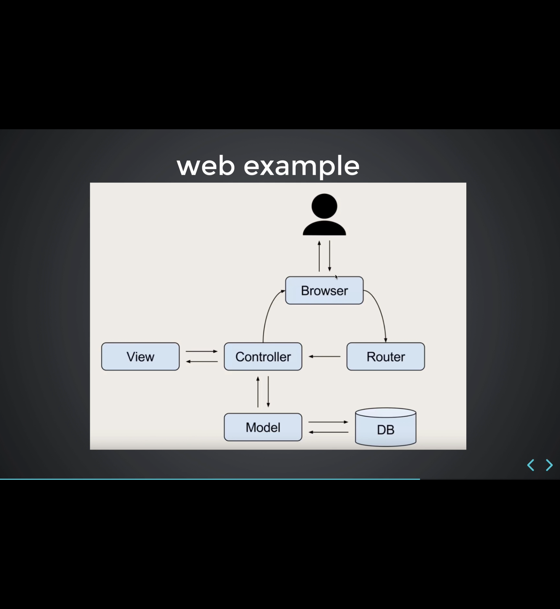

# Schema & Query Design
* 서비스를 만들 때 가장 먼저 해야하는 일은 어떤 데이터가 필요한지 파악하고 데이터 간의 상관관계를 정의하는 것이 중요하다.
* 스키마란 데이터베이스의 청사진이다.
* 데이터베이스는 각각의 테이블이 있고 그 안의 열들을 필드라고 부른다. 그리고 그 열들의 값을 레코드라고 한다.
* 관계형 데이터베이스는 테이블 간의 관계를 구조화 해야 한다.(ID로 대체하는 것이 대표적)
* 1 대 다의 관계형 데이터베이스에서는 서로 상관관계를 보고 상대를 하나만 가질 것 같은 테이블에다가 그 관계를 하나만 넣어주는 것이 좋다.(예시: 과목 테이블에 선생님의 ID를 넣기)
* 다 대 다의 관계에서는 ID만 갖는 테이블을 만들어서 1 대 다의 관계로 만들어 준다.

**JOIN**
* 두 개 이상의 테이블을 합쳐서 쓰고 싶을 때 사용하며, inner join, left join이 주로 많이 쓰임

# MVC design pattern
* Model View Controller의 약자
* 소프트웨어가 돌아가는 하나의 패턴(특정 라이브러리 x)
* 애플리케이션의 기능을 나누는 것이 특징

**Model**
* 데이터를 다룬다.
* 데이터베이스와 상호작용
* 데이터를 가지고 controller와 상호작용

**View**
* 유저가 보는 화면을 보여주게 하는 역할
* controller와 상호작용
* 데이터를 받으면 그걸 가지고 그리는 역할

**Contoller**
* view에서 일어나는 액션과 인풋 값을 받는다.
* 모델에게 가공된 데이터를 넘겨준다.
* 모델에게서 받은 데이터를 가공하여 다시 뷰에게 넘겨준다.

