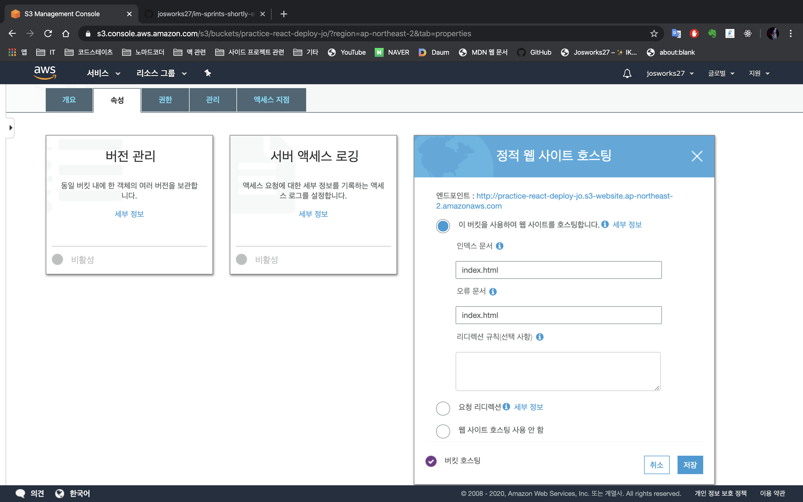
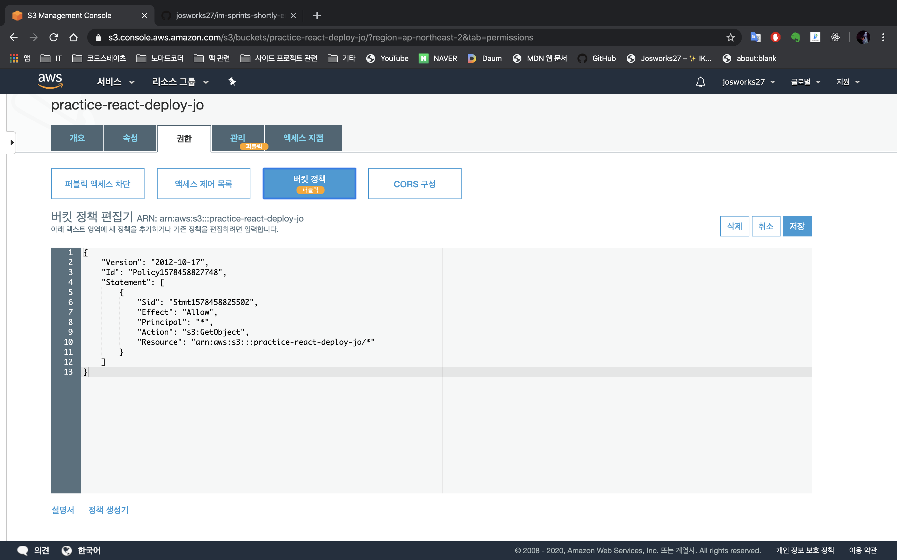
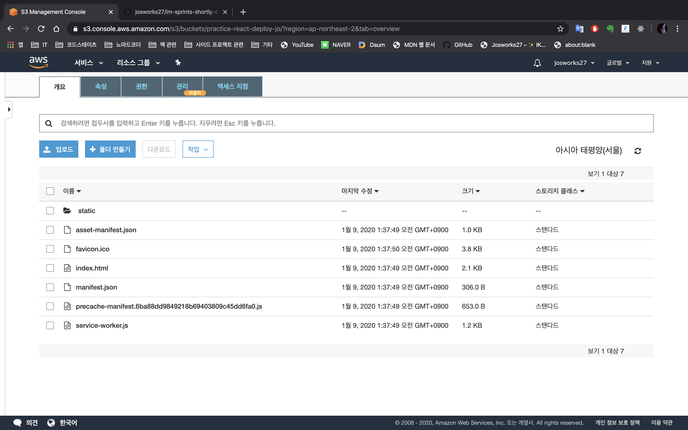
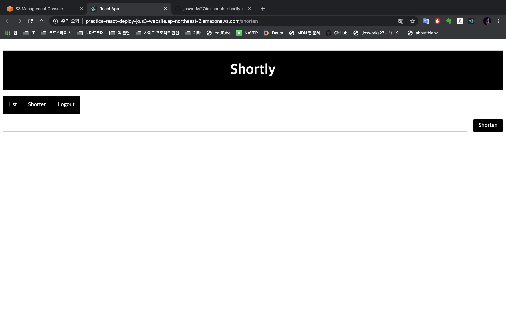
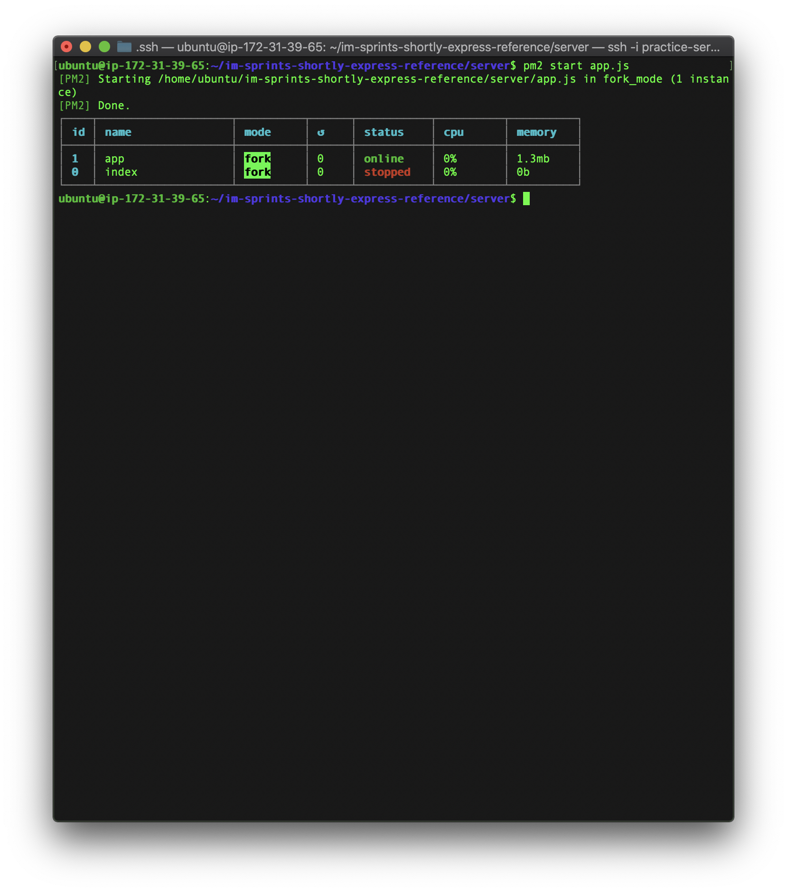

# 리액트로 만든 SPA를 AWS S3로 배포하기

## 1.React Build
* 리액트로 만든 클라이언트를 webpack을 이용한 정적인 파일로 만든다.
* 리액트는 다음 커맨드를 이용하여 만들 수 있다.

```
yarn build
```

## 2.Create Bucket
* AWS Management Console에서 s3 서비스로 접속한 뒤 버킷을 만든다.
* 만든 버킷의 속성에서 정적 웹사이트 호스팅 설정


## 3.Public Access
* 권한에서 퍼블릭 엑세스 차단 모든 비활성화하여 접근하기 용이하기 만든다.(테스트를 위함)
* 버킷 정책도 정책 생성기의 도움을 받아 접근하기 용이한 형태로 설정해 준다.


* 리액트 build 파일들을 개요에 업로드


* 엔드포인트에 접속하면 리액트 화면 보인다!



# 익스프레스로 만든 서버를 AWS EC2로 배포하기
* 익스프레스로 서버를 구축한다.
* 나중에 AWS RDS를 이용하여 데이터베이스로 이용할 예정이므로 관련 설정도 미리 해둔다.
* 구축한 서버를 직접 EC2에 배포하는 것이 힘들기 때문에 github을 이용해야 한다.

## 1.Start Instance
* ES2 인스턴스를 만든다. (민드는 방법은 구글에 많기 때문에 생략하겠다.)

## 2.Environment Settings
* 인스턴스를 연결하고 node.js와 npm을 설치한다.
* 설치 후 git clone을 통해 아까 github에 push해 놓은 익스프레스 서버를 클로닝 한다.
* 추가적으로 서버를 지속적으로 작동시키기 위해 PM2를 설치한다.



# AWS RDS 인스턴스 만들기
* AWS console에서 RDS 인스턴스 세팅을 하고 생성한다.
* RDS 인스턴스 생성 후 데이터베이스에 접근 가능한지 확인한다.
* CLI에선 아래와 같은 명령어로 가능하다.(GUI 클라이언트를 이용하면 간단히 볼 수 있다는 장점이 있다.)

```
mysql.server start

mysql -u '유저명' --host '호스트명' -P '포트번호' -p
```