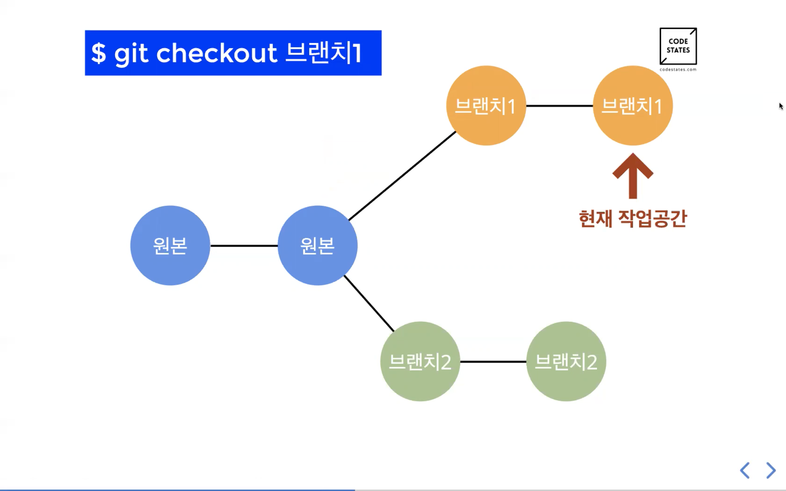
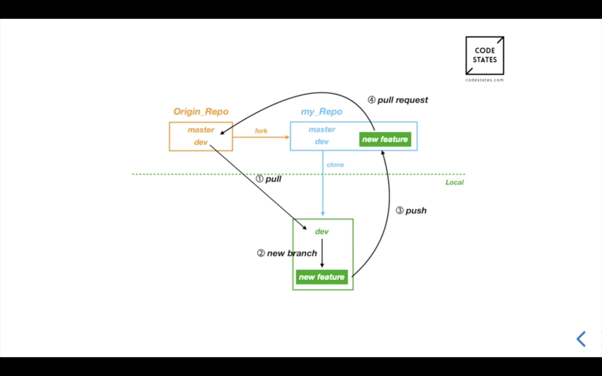

# Git Branch

* 분리된 작업 영역이며 사본이라고 생각하면 좋음(원본에 영향이 없음)
* 각각의 브랜치는 독립된 작업 영역

##### 왜 필요할까?

* 여러명이 하나의 프로젝트를 작업할 때, 하나의 코드로 작업할 수 없기 때문이다.
* 각자 자신의 브랜치에서 서로에게 영향을 주지 않고 기능을 개발할 수 있다.
* 새로운 것을 시도해 보고 싶을 때

##### 브랜치  관련 주요 명령어

* 브랜치는 현재 작업 공간(헤드가 있는 곳)을 기준으로 만들어 진다.
* 작업 공간(브랜치)을 옮기는 방법
  * git checkout <브랜치 이름>
* 브랜치 생성 방법
  * git checkout -b <기능1> : 해당 브랜치를 생성 + 해당 브랜치로 이동이 합쳐진 명령어

##### 원본을 베이스로 하는 다른 브랜치를 만드는 방법

* 1. 베이스로 하고 싶은 브랜치로 작업 공간(헤드)을 옮긴다.
     * git checkout <이동할 브랜치>
  2. 브랜치를 생성한다.
     * git checkout -b <기능2>

# Project git workflow

* fork 후 마스터 레포를 갖고 온다.
* git clone해서 로컬로 가져온다.
* 마스터 레포와 로컬을 연결한다.(작업하기 전 항상 로컬 dev 최신화)
  1. pull 명령어로 로컬의 dev 브랜치를 최신화한다. (항상)
  2. 최신화한 로컬 dev를 기준으로 새로운 브랜치 만든다.
  3. 코드를 작성한다.
  4. 코드를 다 작성하면 자신의 레포의 Push 한다.
     * 여기서 중요한 점은 자신의 레포의 dev에 push (x)
     * 자신의 레포에 새로운 브랜치(각 기능의)를 만들어서 push
  5. 마스터 레포에 pull request 한다.
  6. 마스터 레포 관리자는 PR을 확인하여 merge해 주면 하나의 기능 개발이 완료!
  7. 이후 새로운 기능은 1~5를 반복 진행한다.

##### 기능 개발 중간에 머지되는 경우

* 충돌이 생기기 때문에 rebase를 해야 한다.
* git rebase dev : 기존 베이스 브랜치가 새로운 브랜치로 바뀐다.
* 하지만 전에 git pull upstream dev로  dev를 최신화 해야 한다.
* 작업하는 코드가 새로운 dev와 연관이 없으면 rebase할 필요 없다
* 하지만 연관이 있다면? git이 충돌체크를 하게되고 충돌을 해결한 후 다음으로 넘어가게 된다.
* 해결하면 git rebase continue 로 다음 충돌을 해결해 나아간다.

# Live

##### Branch 

중요! 헤드가 어디에 있는지 꼭 확인하고 작업하기 !! 문제생김!

* 하나의 브랜치는 하나의 기능
* git checkout은 정확히는 head를 옮기는 명령어
* git checkout <commit 스트링> : 해당 커밋의 브랜치로 헤드를 이동
* 브랜치를 만든 곳에서 가지가 뻗어나간다.

##### git flow

* 보통 마스터에 직접작업보다 마스트를 기반으로 하는 dev를 만들어서 작업
* 각각의 기능을 구현할 때 각각의 브랜치 만들기
* dev는 항상 최신이어야 한다. (중요)
* upstream : 최상위 레포를 의미
* 각 기능 개발하면서 커밋 잘하기
* 기능 개발 끝나면 git push origin addList로 push (dev X)
* 그리고 upstream의 dev로 PR 날리기
* 머지는 팀의 합의하에 업스트림에 합쳐주기
* 그래서 다음 기능 개발할 때는 업스트림의 dev에서 git pull upstream dev 해서 최신화된 dev로 다시 작업해야 한다
* pr이 여러개여서 머지할 때 충돌사항이 있는 경우, 들어온 순서대로 머지하고 다음 pr이 충돌이 있다면 해결하고 합치기